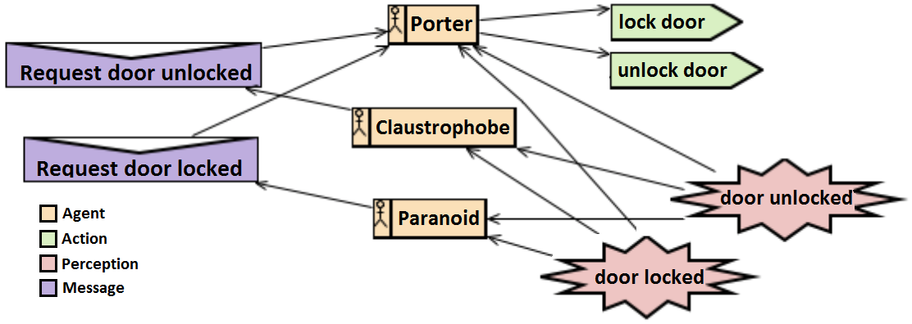
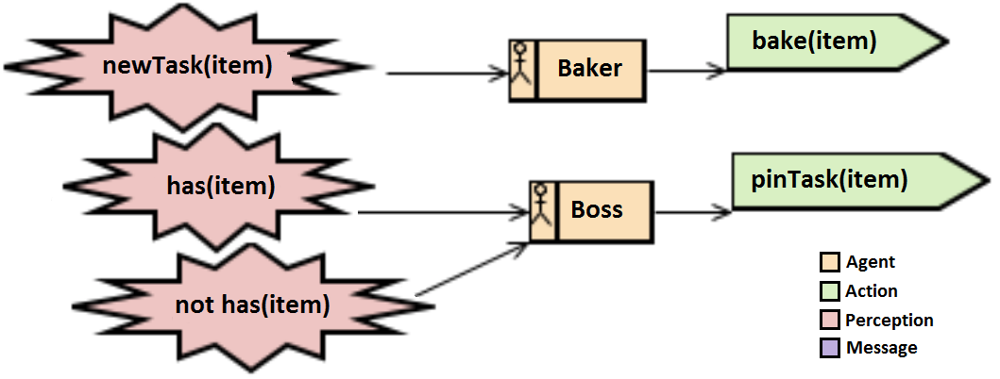

<a href="https://travis-ci.org/Maumagnaguagno/Locus" target="_blank">

</a>

--------------------

> [Jason](http://jason.sourceforge.net/) is an AgentSpeak interpreter for multi-agent system development. The agents are describbed in AgentSpeak, but the environment requires a Java description of how the actions and perceptions happen. We aim to close the gap between the descriptions with an AgentSpeak-like description of the environment, targeting new users and simpler examples. Locus generates the Java source required by Jason, giving the user an easier starting point to create complex environments without limiting the user to the tool. The Java output can be further modified if required.

## The Language

AgentSpeak uses plans to describe agent behavior. Those plans are made of a triggering event, a new perception or belief, happening at a given context, current state, is enough to execute the action in the body of the plan. This is a simple way to define which, when and what happens for an agent.
```
triggeringEvent : context <- body .
```

With this in mind we created a tool to parse an environment description in this form and output the Java expected environment of Jason. With this we hope to make the system easier for new users while being able to keep environment descriptions safe from the revisions of Jason's API. In order to achieve this we created some constructs to affect the environment at specific points in time. **init** is triggered at the initialization of the environment. **stop** is triggered at the end of the simulation. **beforeActions** and **afterActions** can be used to clear and add perceptions dependending of the current state.
Each action added to the environment has a name and N terms, can be applied every time it is called with a context evaluating to true.
```
init                                  <- body.

beforeActions                         <- body.
+action(name[, terms]) : context      <- body.
afterActions                          <- body.

stop                                  <- body.
```

The body of these constructs can be used to add or remove perceptions, add, remove or overwrite the current state.
```
+percept(agent|all, predicate[, terms]) : context.
-percept(agent|all, predicate[, terms]) : context.
-percept(all).
-percept(bob).

+state(predicate[, terms]).
-state(predicate[, terms]).
-+state(predicate[, terms]).
```

For the context you can check state and agent definition, but the system currently does not parse complex operations (with and/or/not, only an atom):

```
+percept(bob, danger) : agentClass(human).
+percept(bob, danger) : agentName(bobs_friend).
+percept(bob, danger) : state(on, bob, fire).
```

Perhaps the most interesting feature is to easily handle the terms of an action. So far we are supporting only strings, but we will add more as required. Beware that free-variables can only be used inside an action context in the current version.

```
+action(bake, C) : agentClass(cooker) <- -+state(have, C).
```

In case you need to do something in Java to describe the behavior of your environment we are exposing **include** and any command inside of the main constructs that can not be parsed by our tool. Therefore you can include any Java library required and use inline Java as normal code. We do not have tests for this feature and recommend you to find a generic abstraction for your case and request support instead of using this last resort.

## [Examples](examples)

We hope the next examples show the power of the description. The room example is part of the Jason set of examples and is maintained without modifications to show compatibility while the others were created by us to explore what we considered important without adding complex behaviors.

### [Room](examples/Room)

In the room application we have 3 agents sharing the same room with a door:
- a porter, the only agent who controls the door
- a claustrophobe, an agent who wants the door to be open
- a paranoid, an agent who wants the door to be closed

The environment's door starts either closed or opened. All agents perceive the state of the door. The claustrophobe or paranoid agent perceive the door in the correct position and does nothing, the other will ask the porter to fix the situation. The porter simply obeys, having no desire for any particular door state. Once the porter finishes the action the process restarts. A Prometheus design shows the room application:

  

We can follow the specification to build the agents and the environment:
- [Porter](examples/Room/porter.asl)
  ```
  +!locked(door)[ source(paranoid)     ] : ~locked(door) <-   lock.
  +!~locked(door)[source(claustrophobe)] :  locked(door) <- unlock.
  ```

- [Paranoid](examples/Room/paranoid.asl)
  ```
  +~locked(door) : true <- .send(porter, achieve, locked(door)).
  +locked(door)  : true <- .print("Thanks for locking the door!").
  ```

- [Claustrophobe](examples/Room/claustrophobe.asl)
  ```
  +locked(door) : true <- .send(porter, achieve, ~locked(door)).
  -locked(door) : true <- .print("Thanks for unlocking the door!").
  ```

- [Room Environment](examples/Room/RoomEnv.esl) ([see Java output](examples/Room/RoomEnv.java))
  ```
  init <-
    +state(doorLocked);
    +percept(all, locked, door).
  
  beforeActions <-
    -percept(all).
  
  +action(lock) : agentClass(porter) <-
    -+state(doorLocked).
  
  +action(unlock) : agentClass(porter) <-
    -+state(~doorLocked).
  
  afterActions <-
    +percept(all, locked, door) : state(doorLocked);
    +percept(all, ~locked, door) : state(~doorLocked).
  ```

### [Bakery React](examples/BakeryReact)

In the bakery react application we have 2 agents:
- a boss, an agent that perceives and reacts to the lack of the items to sell in the bakery
- a baker, the agent responsible to make the items in the bakery

The environment starts without some items, the boss perceives the lack of them. And every time an item is not in the shelf a client can not buy it, the boss pins a task to do more of this item in a board, the baker will perceive this task and bake. The baker simply obeys the boss. Both agents simply react to perceptions from the environment. A Prometheus design shows the bakery react application:

  

We can follow the specification to build the agents and the environment:
- [Boss](examples/BakeryReact/boss.asl)
  ```
  +~have(C) <- pinTask(C).
  +have(C) <- .print("Done ", C).
  ```

- [Baker](examples/BakeryReact/baker.asl)
  ```
  +newTask(X) <- bake(X).
  ```

- [Bakery Environment](examples/BakeryReact/Bakery.esl) ([see Java output](examples/BakeryReact/Bakery.java))
  ```
  init <-
    +state(~have(pie));
    +state(~have(cake));
    +state(~have(donut));
    +percept(boss, ~have, pie);
    +percept(boss, ~have, cake);
    +percept(boss, ~have, donut).

  beforeActions <-
    -percept(all).

  +action(pinTask, C) : agentName(boss) <-
    +percept(all, newTask, C).
    
  +action(bake, C) : agentClass(cooker) <-
    -+state(have, C).
    
  afterActions <-
    +percept(boss, ~have, pie) : state(~have(pie));
    +percept(boss, ~have, cake) : state(~have(cake));
    +percept(boss, ~have, donut) : state(~have(donut));
    +percept(boss, have, pie) : state(have(pie));
    +percept(boss, have, cake) : state(have(cake));
    +percept(boss, have, donut) : state(have(donut)).
  ```

## How it works

A [Ruby script](Locus.rb) works as a [source-to-source compiler](http://en.wikipedia.org/wiki/Source-to-source_compiler), parsing the environment description, optimizing and converting to Java, the core language of Jason. Instead of creating the file from scratch, the script only fill the [template file](locus_env.java). The blanks filled match the constructs like init, helper functions and internal variables required to work. The current version already uses a few optimization tricks to avoid redundancy, the **Literals** are stored in variables to be reused as required. We hope to add more optimizations (if-else), and make the Literals more readable using a better name convention for the variables.

## Testing

Tests were made to ensure compatibility with previous and future versions. We are testing with Travis-CI to support the following versions/flavors of Ruby:
- [MRI](http://en.wikipedia.org/wiki/Ruby_MRI) (C)
  - 1.8.7
  - 1.9.3
  - 2.0.0
  - 2.1.0
- [JRuby](http://en.wikipedia.org/wiki/JRuby) (Java)
  - mode 1.8
  - mode 1.9

## Execution

With your **.esl** file ready you can launch Ruby to make the conversion to Java, the output is a file in the same folder of the file provided as input. 

```
ruby Locus.rb MyEnvironment.esl
```
or
```
ruby Locus.rb projects\thisproject\MyEnvironment.esl
```

Note that a file named ```RoomEnv.esl``` will generate ```RoomEnv.java``` and **RoomEnv** must be present in your setup file (**.mas2j**) to be used as your environment. Since we rely on the setup file to obtain the agent's class during run-time we expect to [receive the setup filename in the arguments of the environment](http://jason.sourceforge.net/faq/faq.html#SECTION00042000000000000000), like this:

```
MAS room {
    infrastructure: Centralised
    environment: RoomEnv("Room.mas2j")
    executionControl: jason.control.ExecutionControl
    agents: porter; claustrophobe; paranoid;
}
```

## Contribution

The Locus was contributed by Mauricio Magnaguagno, Ramon Fraga Pereira, and Anibal Solon Heinsfeld.
To cite Locus, please cite this [paper](http://www2.ic.uff.br/~wesaac2015/Proceedings-WESAAC-2015.pdf):

Ramon Fraga Pereira, Mauricio Magnaguagno, Anibal Solon Heinsfeld and Felipe Meneguzzi (2015). LOCUS: An environment description language for JASON, In WESAAC 2015. pp. 21-32.

## ToDo's

- Add more tests
- Check version of Jason jar being used here
- Add multi-line comment support
- Optional condition block for actions
- Optional condition block for afterActions and beforeActions
- Arity check for actions
- Complex formulas in conditions (&/|/~/not/())
- Unifications
- Add perception checks (context)
- Add belief check (context)
- Add different term type support
- Separate parser from output generator methods, being able to generate other outputs
  - This would makes Locus output language agnostic and easy to extend.
